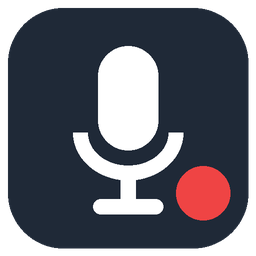

<p align="center"></p>

<h1 align="center">MicroRecord</h1>

<p align="center"><b>Одна горячая клавиша — и встреча записана.</b><br>
Портативный рекордер для Windows: ваш микрофон и звук собеседников в одном файле. Без облака, без установки, без телеметрии.</p>

<p align="center"><i>A portable one-hotkey meeting recorder for Windows: your microphone plus everyone else (system audio) in a single MP3. No cloud, no install, no telemetry.</i></p>

---

## Зачем

Zoom, Teams, Meet, Telegram, звонок в браузере — неважно, где идёт разговор. Нажимаете **Ctrl+Alt+R**, говорите, нажимаете ещё раз — в папке появляется `meeting_20261006_191154.mp3`. Дальше файл можно слушать, отправить коллегам или скормить любой программе расшифровки.

## Возможности

- **Горячая клавиша** (по умолчанию `Ctrl+Alt+R`) и значок в трее, который краснеет во время записи.
- **Микрофон + системный звук** в одном файле.
- **Раздельные дорожки**: слева вы, справа собеседники — громкость каждой стороны можно поправить потом, а расшифровщикам проще различать говорящих.
- **MP3, M4A (AAC), FLAC или WAV** — сжатие встроенными кодеками Windows. MP3 128 кбит/с — около 55 МБ за час вместо 1,4 ГБ несжатого звука.
- **Надёжность**: во время записи пишется WAV, сжатие — после остановки. Если что-то пошло не так, WAV остаётся.
- **Работает там, где другие не могут.** Если антивирус или корпоративная политика (например, Kaspersky) запрещает программам открывать звуковые устройства, MicroRecord:
  - пишет системный звук через *process loopback* (виртуальное устройство Windows, не трогающее заблокированные endpoint'ы);
  - пишет микрофон через вкладку вашего браузера, которому антивирус доверяет.
- **Автостоп**: запись сама останавливается через заданное время (по умолчанию 3 часа) — на случай, если забыли выключить.
- **Обработка записи**: обрезка по времени (начало/конец) и разбивка на части заданного размера (по умолчанию 20 МБ) — удобно для загрузки на транскрибацию.
- **Свои уведомления**: мгновенные всплывающие сообщения в углу экрана вместо уведомлений Windows (те приходят с задержкой); не перехватывают фокус и сами исчезают.
- **Настройки**: громкость микрофона и системного звука, автоусиление и шумоподавление, формат и битрейт с оценкой размера, папка, шаблон имени, горячая клавиша, автозапуск, автостоп, размер части, тестовая запись на 5 секунд.
- **Портативность**: один `.exe`, настройки — `settings.json` рядом с ним.
- **Приватность**: никаких сетевых запросов наружу. Единственное сетевое соединение — локальное (`127.0.0.1`) между программой и вкладкой браузера, если она используется.

## Установка

**Одной командой** (PowerShell, без прав администратора и без окна SmartScreen):

```powershell
irm https://raw.githubusercontent.com/michailr1/microrecord/main/install.ps1 | iex
```

Скрипт ([install.ps1](install.ps1)) скачивает последний релиз в `%LOCALAPPDATA%\Programs\MicroRecord`, сверяет SHA-256, добавляет ярлык в меню «Пуск» и запускает программу. Той же командой программа обновляется.

**Вручную:** скачайте EXE со страницы [Releases](https://github.com/michailr1/microrecord/releases/latest), положите в любую папку и запустите.

| Файл | Размер | Когда выбирать |
|---|---|---|
| `MicroRecord-win-x64.exe` | ~50 МБ | Работает сразу, внутри всё нужное. |
| `MicroRecord-win-x64-net9.exe` | ~2 МБ | Если установлен [.NET 9 Desktop Runtime](https://dotnet.microsoft.com/download/dotnet/9.0); если нет — Windows предложит его скачать. |

**Требования:** Windows 10 версии 2004 (сборка 19041) или новее, x64.

### «Система Windows защитила ваш компьютер»

Программа пока не подписана цифровой подписью, поэтому при первом запуске скачанного браузером файла SmartScreen показывает предупреждение (установка командой выше его не вызывает). Варианты (права администратора не нужны):

- нажмите **«Подробнее» → «Выполнить в любом случае»**;
- если этой кнопки нет или Windows просит пароль администратора — снимите с файла пометку «скачан из интернета» **до запуска**: правый щелчок по EXE → **Свойства** → внизу вкладки «Общие» отметьте **«Разблокировать»** → OK. Или в PowerShell:
  ```powershell
  Unblock-File "$env:USERPROFILE\Downloads\MicroRecord-*.exe"
  ```

После первого запуска MicroRecord сам снимает с себя эту пометку, так что окно больше не появится. Если и после этого запуск запрещён, программы на компьютере ограничивает корпоративная политика (AppLocker, контроль программ антивируса) — нужна заявка в IT. Контрольные суммы файлов — в `SHA256SUMS.txt` на странице релиза.

## Использование

| Действие | Как |
|---|---|
| Начать / остановить запись | `Ctrl+Alt+R` или двойной щелчок по значку в трее |
| Обработка записи (обрезка, разбивка) | правый щелчок по значку → **Обработка записи…** |
| Настройки | правый щелчок по значку → **Настройки…** |
| Где записи | `Документы\MicroRecord` (меняется в настройках) |
| Лог | `Документы\MicroRecord\microrecord.log` |

**Если микрофон пишется через браузер.** При первом запуске откроется вкладка `127.0.0.1:47123` и браузер спросит доступ к микрофону — разрешите и отметьте «Разрешать при каждом посещении». Не закрывайте вкладку, пока идёт запись. Если вы знаете, что на вашем компьютере микрофон всегда блокируется, выберите в настройках «Сразу через вкладку браузера» — запись будет стартовать быстрее.

## Как это устроено

Каждая сторона перебирает способы захвата по порядку и берёт первый работающий:

| Системный звук | Микрофон |
|---|---|
| 1. WASAPI loopback на устройстве по умолчанию | 1. WASAPI capture на устройстве по умолчанию |
| 2. Process loopback — все приложения, кроме MicroRecord | 2. WASAPI через `ActivateAudioInterfaceAsync` |
| | 3. WinMM `waveIn` |
| | 4. Вкладка браузера: `getUserMedia` → AudioWorklet → WebSocket на `127.0.0.1` |

Оба потока сводятся микшером, который идёт по реальному времени (NAudio `RealtimeCaptureMixer`), и пишутся в 16-битный WAV. После остановки Media Foundation кодирует его в выбранный формат.

Если запись не работает: **Настройки → Диагностика → Диагностика звука** проверяет все устройства и способы захвата и пишет подробный отчёт в лог. Приложите его к [issue](https://github.com/michailr1/microrecord/issues).

## Сборка

```
# полная версия (среда .NET внутри, сжатая)
dotnet publish MicroRecord.csproj -c Release -r win-x64 --self-contained true -p:EnableCompressionInSingleFile=true -o publish/full
# маленькая версия (нужен .NET 9 Desktop Runtime)
dotnet publish MicroRecord.csproj -c Release -r win-x64 --self-contained false -o publish/small
```

Нужен .NET 9 SDK. GitHub Actions собирает обе версии на каждый push. Релиз: тег `vX.Y.Z` или **Actions → Build MicroRecord → Run workflow** с полем `release_tag` — сборки и SHA256SUMS.txt появятся в Releases.

Зависимости: [NAudio](https://github.com/naudio/NAudio) 3.x (WASAPI, process loopback, Media Foundation, микшер). Кодеки — встроенные в Windows.

## Подпись кода и приватность

Политика подписи кода и приватности: [CODE_SIGNING.md](CODE_SIGNING.md). Free code signing provided by [SignPath.io](https://signpath.io), certificate by [SignPath Foundation](https://signpath.org) (после одобрения заявки; до этого релизы публикуются без подписи).

MicroRecord не передаёт никакие данные по сети: записи, настройки и лог остаются на компьютере.

## Лицензия

[MIT](LICENSE) — свободно используйте, изменяйте и распространяйте, сохраняя указание авторства. Программа предоставляется «как есть», без гарантий.
